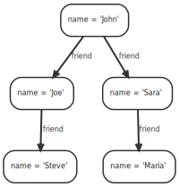

# 3. Cypher

###### 이 장에는 Cypher 쿼리 언어에 대한 완전하고 권위있는 문서가 포함되어 있습니다.

## 3.1. 소개

간단한 소개는 [3.1.1. " Cypher는 무엇입니까?"](#311-cypher는-무엇입니까)에서 볼 수 있습니다. 첫 발을 딛기 위해서  [2.2. "Cypher 시작하기"](../get-started/cypher.html)를 시작하십시오. 용어 사용에 대해서는  [Appendix B, 용어](./terminology.html)를 참조하시면 됩니다.

- [Cypher는 무엇입니까?](#311-cypher는-무엇입니까)
- [그래프 쿼리 및 업데이트](./introduction/query-the-graph.html)
- [트랜잭션](./introduction/transactions.html)
- [고유성](./introduction/uniqueness.html)
- [적합성](./introduction/compatibility.html)

### 3.1.1. Cypher는 무엇입니까?

Cypher 는 그래프 저장소의 표현과 효율적인 쿼리 및 업데이트를 위한 서술적인 그래프 쿼리 언어입니다. Cypher는 비교적 간단하지만 매우 강력한 언어입니다. 매우 복잡한 데이터베이스 쿼리는 Cypher를 통해 쉽게 표현할 수 있습니다. 이렇게 하면 데이터베이스 접근에 헤매지 않고 도메인에 집중할 수 있습니다.

Cypher는 개발자 및 (중요하게 우리가 생각하는) 운영 전문가에게 적합한 사람적인 쿼리 언어로 설계되었습니다. 우리의 목표는 간단한 것을 쉽고 복잡한 일을 가능하게 만드는 것입니다. 쿼리 구조는 영어 산문형식과 도해법을 기반으로하며 이는 쿼리를 좀 더 이해하기 편하게 합니다. 우리는 글쓰기가 아닌 읽기를 위해 언어를 최적화하려고 노력했습니다.

선언적 언어이기 때문에 Cypher는 그래프를 *검색 하는 방법* 이 아니라 그래프에서 *검색 할 내용* 을 명확하게 표현하는 데 중점을 둡니다. 이것은 Java와 같은 명령형 언어, [Gremlin](http://gremlin.tinkerpop.com/), [JRuby Neo4j bindings](https://github.com/neo4jrb/neo4j/)와 같은 스크립팅 언어와는 대조적입니다. 이 접근 방식은 쿼리 최적화를 사용자에게 부담시키지 않고 물리적 데이터베이스 구조가 변경 되었기 때문에 (새 인덱스 등) 모든 traversals를 업데이트하도록 요구하지 않고 구현 세부 사항을 만듭니다.

 Cypher는 다양한 접근 방식에서 영감을 얻었으며 표현적인 쿼리를 위해 기존 방식을 기반으로합니다. ```WHERE``` 및 ```ORDER BY``` 와 같은 대부분의 키워드는 [SQL](http://en.wikipedia.org/wiki/SQL) 에서 영감을 받았습니다. 패턴 매칭은 [SPARQL](http://en.wikipedia.org/wiki/SPARQL) 에서 표현 접근법을 빌려 왔습니다. 콜렉션 의미 중 일부는 Haskell 및 Python과 같은 언어에서 빌려 왔습니다.


#### 구조

 Cypher는 SQL에서 구조를 차용합니다. 다양한 절을 사용하여 쿼리가 작성됩니다.

절은 함께 묶여 있고 서로간에 중간 결과 집합을 제공합니다. 예를 들어, 하나의 ```MATCH``` 절에서 일치하는 변수는 다음 절이있는 문맥이됩니다.

쿼리 언어는 몇 가지 고유 한 절로 구성됩니다. 자세한 내용은 매뉴얼의 뒷부분에서 읽을 수 있습니다.

 다음은 그래프에서 읽는 데 사용되는 몇 가지 절입니다:

- ```MATCH```: 일치시킬 그래프 패턴. 그래프에서 데이터를 가져 오는 가장 일반적인 방법입니다.
- ```WHERE```: 절의 조항이 아니라 ```MATCH```, ```OPTIONAL MATCH``` 및 ```WITH``` 일부입니다. 패턴에 제약 조건을 추가하거나 ```WITH``` 의 중간 결과를 필터링합니다.
- ```RETURN```: 결과를 돌려줍니다.

``MATCH`` 및 ``RETURN`` 이 수행되는 것을 확인합니다.

다음과 같은 예제 그래프를 상상해보십시오.

그림 3.1. 예제 그래프


예를 들어, 'John'과 발견한 친구의 친구를 모두 반환하기 전에 'John'과 'john'의 친구(직접적인 관계가 아닌)를 찾는 쿼리가 있습니다.

```Javascript
MATCH (john {name: 'John'})-[:friend]->()-[:friend]->(fof)
RETURN john.name, fof.name
```
결과값:

```
+----------------------+
| john.name | fof.name |
+----------------------+
| "John"    | "Maria"  |
| "John"    | "Steve"  |
+----------------------+
2 rows
```

다음으로 우리는 행위에 더 많은 부분을 설정하기 위해 필터링을 추가합니다:

사용자 이름 목록을 가져와서 이 목록의 이름을 가진 모든 노드를 찾아 친구들과 일치 시키고 'S'로 시작하는 '이름' 속성을 가진 친구를 반환합니다.

```Javascript
MATCH (user)-[:friend]->(follower)
WHERE user.name IN ['Joe', 'John', 'Sara', 'Maria', 'Steve'] AND follower.name =~ 'S.*'
RETURN user.name, follower.name
```

결과값:
```
+---------------------------+
| user.name | follower.name |
+---------------------------+
| "Joe"     | "Steve"       |
| "John"    | "Sara"        |
+---------------------------+
2 rows
```

다음은 그래프를 업데이트하는데 사용되는 절의 예입니다 :

- ```CREATE``` (또는 ```DELETE```): 노드와 관계를 생성 또는 삭제.
- ```SET``` (또는 ```REMOVE```): ```Set```을 이용해서 노드의 값의 속성 및 레이블을 지정하거나 ```REMOVE```로 제거.
- ```MERGE```: 기존 노드와 일치하거나 새노드와 패턴을 만듭니다. 이는 고유성 제약 조건과 함께 유용합니다.
