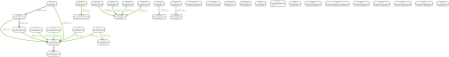

### 3.7.3. 연산자 결합

###### 결합 연산자는 다른 연산자를 결합하는데 사용됩니다.

다음 그래프는 아래의 예제에서 사용됩니다.

**Figure 3.24. 그래프**


#### 3.7.3.1. Apply

```Apply```는 중첩 루프를 수행하여 작동합니다. ```Apply``` 연산자의 왼쪽에서 생성되는 모든 행은 오른쪽에있는 잎 연산자에 공급되고 ```Apply```는 결합된 결과를 나타냅니다. 중첩된 루프인 ```Apply```은 더 나은 계획을 찾을 수 없다는 경고로 볼 수 있습니다.

**Query.**
```Javascript
MATCH (p:Person)-[:FRIENDS_WITH]->(f)
WITH p, count(f) AS fs
WHERE fs > 2
OPTIONAL MATCH (p)-[:WORKS_IN]->(city)
RETURN city.name
```
2명 이상의 친구가 있는 모든 사람들을 찾아서 그들이 근무하는 도시를 반환합니다.

**Query plan.**
```
+----------------------+----------------+----------------------------------------------+----------------------------------------+
| Operator             | Estimated Rows | Variables                                    | Other                                  |
+----------------------+----------------+----------------------------------------------+----------------------------------------+
| +ProduceResults      |              1 | city.name                                    | city.name                              |
| |                    +----------------+----------------------------------------------+----------------------------------------+
| +Projection          |              1 | city.name -- anon[70], anon[93], city, fs, p | {city.name : city.name}                |
| |                    +----------------+----------------------------------------------+----------------------------------------+
| +OptionalExpand(All) |              1 | anon[93], city -- anon[70], fs, p            | (p)-[:WORKS_IN]->(city)                |
| |                    +----------------+----------------------------------------------+----------------------------------------+
| +Filter              |              1 | anon[70], fs, p                              | anon[70]                               |
| |                    +----------------+----------------------------------------------+----------------------------------------+
| +Projection          |              1 | anon[70] -- fs, p                            | {p : p, fs : fs,  : fs > {  AUTOINT0}} |
| |                    +----------------+----------------------------------------------+----------------------------------------+
| +EagerAggregation    |              1 | fs -- p                                      | p                                      |
| |                    +----------------+----------------------------------------------+----------------------------------------+
| +Expand(All)         |              2 | anon[17], f -- p                             | (p)-[:FRIENDS_WITH]->(f)               |
| |                    +----------------+----------------------------------------------+----------------------------------------+
| +NodeByLabelScan     |             14 | p                                            | :Person                                |
+----------------------+----------------+----------------------------------------------+----------------------------------------+

Total database accesses: ?
```
#### 3.7.3.2. SemiApply

패턴 술어의 존재 여부를 테스트합니다. ```SemiApply```는 자식 연산자에서 한 행을 가져 와서 오른쪽의 리프(leaf) 연산자로 전달합니다. 오른쪽 연산자 트리가 적어도 하나의 행을 생성하면 왼쪽의 행이 ```SemiApply``` 연산자에 의해 생성됩니다. 이것은 ```SemiApply```를 필터링 연산자로 만들고, 주로 쿼리의 패턴 술어에 사용됩니다.

**Query.**
```Javascript
MATCH (p:Person)
WHERE (p)-[:FRIENDS_WITH]->()
RETURN p.name
```
친구가 있는 모든 사람들을 찾습니다.

**Query plan.**
```
+------------------+----------------+-------------------------+-------------------------+
| Operator         | Estimated Rows | Variables               | Other                   |
+------------------+----------------+-------------------------+-------------------------+
| +ProduceResults  |             11 | p.name                  | p.name                  |
| |                +----------------+-------------------------+-------------------------+
| +Projection      |             11 | p.name -- p             | {p.name : p.name}       |
| |                +----------------+-------------------------+-------------------------+
| +SemiApply       |             11 | p                       |                         |
| |\               +----------------+-------------------------+-------------------------+
| | +Expand(All)   |              2 | anon[27], anon[45] -- p | (p)-[:FRIENDS_WITH]->() |
| | |              +----------------+-------------------------+-------------------------+
| | +Argument      |             14 | p                       |                         |
| |                +----------------+-------------------------+-------------------------+
| +NodeByLabelScan |             14 | p                       | :Person                 |
+------------------+----------------+-------------------------+-------------------------+

Total database accesses: ?
```
#### 3.7.3.3. AntiSemiApply

패턴 술어의 존재 여부를 테스트합니다. ```SemiApply```는 자식 연산자에서 한 행을 가져 와서 오른쪽의 리프(leaf) 연산자로 전달합니다. 오른쪽 연산자 트리가 적어도 하나의 행을 생성하면 왼쪽의 행이 ```SemiApply``` 연산자에 의해 생성됩니다. 이것은 ```SemiApply```를 필터링 연산자로 만들고, 주로 쿼리의 패턴 술어에 사용됩니다.

**Query.**
```Javascript
MATCH (me:Person { name: "me" }),(other:Person)
WHERE NOT (me)-[:FRIENDS_WITH]->(other)
RETURN other.name
```
내 친구들이 아닌 모든 사람들의 이름을 찾습니다.

**Query plan.**
```
+--------------------+----------------+-------------------------+-------------------------------+
| Operator           | Estimated Rows | Variables               | Other                         |
+--------------------+----------------+-------------------------+-------------------------------+
| +ProduceResults    |              4 | other.name              | other.name                    |
| |                  +----------------+-------------------------+-------------------------------+
| +Projection        |              4 | other.name -- me, other | {other.name : other.name}     |
| |                  +----------------+-------------------------+-------------------------------+
| +AntiSemiApply     |              4 | me, other               |                               |
| |\                 +----------------+-------------------------+-------------------------------+
| | +Expand(Into)    |              0 | anon[62] -- me, other   | (me)-[:FRIENDS_WITH]->(other) |
| | |                +----------------+-------------------------+-------------------------------+
| | +Argument        |             14 | me, other               |                               |
| |                  +----------------+-------------------------+-------------------------------+
| +CartesianProduct  |             14 | me -- other             |                               |
| |\                 +----------------+-------------------------+-------------------------------+
| | +NodeByLabelScan |             14 | other                   | :Person                       |
| |                  +----------------+-------------------------+-------------------------------+
| +NodeIndexSeek     |              1 | me                      | :Person(name)                 |
+--------------------+----------------+-------------------------+-------------------------------+

Total database accesses: ?
```
#### 3.7.3.4. LetSemiApply

패턴 술어의 존재 여부를 테스트합니다. 쿼리에 여러 패턴 술어가 있는 경우 ```LetSemiApply```를 사용하여 첫 번째 패턴을 평가합니다. 그것은 술어를 평가한 결과를 기록하지만 다른 운영자에게 필터링을 남겨 둡니다.

**Query.**
```Javascript
MATCH (other:Person)
WHERE (other)-[:FRIENDS_WITH]->() OR (other)-[:WORKS_IN]->()
RETURN other.name
```
친구가 있거나 어딘가에서 일하는 모든 사람들의 이름을 찾습니다. ```LetSemiApply``` 연산자는 각 사람으로부터 ```FRIENDS_WITH``` 관계의 존재를 확인하는데 사용됩니다.

**Query plan.**
```
+--------------------+----------------+-------------------------------+-----------------------------+
| Operator           | Estimated Rows | Variables                     | Other                       |
+--------------------+----------------+-------------------------------+-----------------------------+
| +ProduceResults    |             13 | other.name                    | other.name                  |
| |                  +----------------+-------------------------------+-----------------------------+
| +Projection        |             13 | other.name -- anon[27], other | {other.name : other.name}   |
| |                  +----------------+-------------------------------+-----------------------------+
| +SelectOrSemiApply |             13 | anon[27] -- other             | anon[27]                    |
| |\                 +----------------+-------------------------------+-----------------------------+
| | +Expand(All)     |             15 | anon[66], anon[80] -- other   | (other)-[:WORKS_IN]->()     |
| | |                +----------------+-------------------------------+-----------------------------+
| | +Argument        |             14 | other                         |                             |
| |                  +----------------+-------------------------------+-----------------------------+
| +LetSemiApply      |             14 | anon[27] -- other             |                             |
| |\                 +----------------+-------------------------------+-----------------------------+
| | +Expand(All)     |              2 | anon[35], anon[53] -- other   | (other)-[:FRIENDS_WITH]->() |
| | |                +----------------+-------------------------------+-----------------------------+
| | +Argument        |             14 | other                         |                             |
| |                  +----------------+-------------------------------+-----------------------------+
| +NodeByLabelScan   |             14 | other                         | :Person                     |
+--------------------+----------------+-------------------------------+-----------------------------+

Total database accesses: ?
```
#### 3.7.3.5. LetAntiSemiApply

패턴 술어 부재에 대한 테스트. 쿼리에 여러 패턴 술어가 포함 된 경우 ```LetAntiSemiApply```를 사용하여 첫 번째 패턴을 평가합니다. 이것은 술어를 평가한 결과를 기록하지만 다른 조작자에게 필터링을 남겨 둡니다. 다음 질의는 친구가 없거나 어딘가에서 일하는 모든 사람들을 찾아냅니다.

**Query.**
```Javascript
MATCH (other:Person)
WHERE NOT ((other)-[:FRIENDS_WITH]->()) OR (other)-[:WORKS_IN]->()
RETURN other.name
```

친구가 없거나 어딘가에서 일하는 모든 사람들을 찾습니다. ```LetAntiSemiApply``` 연산자는 각 사람으로부터 ```FRIENDS_WITH``` 관계가 없음을 확인하는데 사용됩니다.

**Query plan.**
```
+--------------------+----------------+-------------------------------+-----------------------------+
| Operator           | Estimated Rows | Variables                     | Other                       |
+--------------------+----------------+-------------------------------+-----------------------------+
| +ProduceResults    |             11 | other.name                    | other.name                  |
| |                  +----------------+-------------------------------+-----------------------------+
| +Projection        |             11 | other.name -- anon[31], other | {other.name : other.name}   |
| |                  +----------------+-------------------------------+-----------------------------+
| +SelectOrSemiApply |             11 | anon[31] -- other             | anon[31]                    |
| |\                 +----------------+-------------------------------+-----------------------------+
| | +Expand(All)     |             15 | anon[71], anon[85] -- other   | (other)-[:WORKS_IN]->()     |
| | |                +----------------+-------------------------------+-----------------------------+
| | +Argument        |             14 | other                         |                             |
| |                  +----------------+-------------------------------+-----------------------------+
| +LetAntiSemiApply  |             14 | anon[31] -- other             |                             |
| |\                 +----------------+-------------------------------+-----------------------------+
| | +Expand(All)     |              2 | anon[39], anon[57] -- other   | (other)-[:FRIENDS_WITH]->() |
| | |                +----------------+-------------------------------+-----------------------------+
| | +Argument        |             14 | other                         |                             |
| |                  +----------------+-------------------------------+-----------------------------+
| +NodeByLabelScan   |             14 | other                         | :Person                     |
+--------------------+----------------+-------------------------------+-----------------------------+

Total database accesses: ?
```
#### 3.7.3.6. SelectOrSemiApply

패턴 술어의 존재를 테스트하고 술어를 평가합니다. 이 연산자를 사용하면 패턴의 존재를 확인하는 패턴 술어와 일반 술어를 혼합 할 수 있습니다. 먼저 정상 표현식 술어가 평가되고, ```false```를 리턴하는 경우에만 비용이 많이 드는 패턴 술어 평가가 수행됩니다.
Tests for the existence of a pattern predicate and evaluates a predicate. This operator allows for the mixing of normal predicates and pattern predicates that check for the existence of a pattern. First the normal expression predicate is evaluated, and only if it returns false the costly pattern predicate evaluation is performed.

**Query.**
```Javascript
MATCH (other:Person)
WHERE other.age > 25 OR (other)-[:FRIENDS_WITH]->()
RETURN other.name
```
친구가 있거나 나이가 '25'이상인 모든 사람들의 이름을 찾습니다.

**Query plan.**
```
+--------------------+----------------+-----------------------------+-----------------------------+
| Operator           | Estimated Rows | Variables                   | Other                       |
+--------------------+----------------+-----------------------------+-----------------------------+
| +ProduceResults    |             11 | other.name                  | other.name                  |
| |                  +----------------+-----------------------------+-----------------------------+
| +Projection        |             11 | other.name -- other         | {other.name : other.name}   |
| |                  +----------------+-----------------------------+-----------------------------+
| +SelectOrSemiApply |             11 | other                       | other.age > {  AUTOINT0}    |
| |\                 +----------------+-----------------------------+-----------------------------+
| | +Expand(All)     |              2 | anon[53], anon[71] -- other | (other)-[:FRIENDS_WITH]->() |
| | |                +----------------+-----------------------------+-----------------------------+
| | +Argument        |             14 | other                       |                             |
| |                  +----------------+-----------------------------+-----------------------------+
| +NodeByLabelScan   |             14 | other                       | :Person                     |
+--------------------+----------------+-----------------------------+-----------------------------+

Total database accesses: ?
```
#### 3.7.3.7. SelectOrAntiSemiApply

패턴 술어가 없는지 테스트하고 술어를 평가합니다.

**Query.**
```Javascript
MATCH (other:Person)
WHERE other.age > 25 OR NOT (other)-[:FRIENDS_WITH]->()
RETURN other.name
```
친구가 없거나 **25** 세 이상인 모든 사람들의 이름을 찾습니다.

**Query plan.**
```
+------------------------+----------------+-----------------------------+-----------------------------+
| Operator               | Estimated Rows | Variables                   | Other                       |
+------------------------+----------------+-----------------------------+-----------------------------+
| +ProduceResults        |              4 | other.name                  | other.name                  |
| |                      +----------------+-----------------------------+-----------------------------+
| +Projection            |              4 | other.name -- other         | {other.name : other.name}   |
| |                      +----------------+-----------------------------+-----------------------------+
| +SelectOrAntiSemiApply |              4 | other                       | other.age > {  AUTOINT0}    |
| |\                     +----------------+-----------------------------+-----------------------------+
| | +Expand(All)         |              2 | anon[57], anon[75] -- other | (other)-[:FRIENDS_WITH]->() |
| | |                    +----------------+-----------------------------+-----------------------------+
| | +Argument            |             14 | other                       |                             |
| |                      +----------------+-----------------------------+-----------------------------+
| +NodeByLabelScan       |             14 | other                       | :Person                     |
+------------------------+----------------+-----------------------------+-----------------------------+

Total database accesses: ?
```
#### 3.7.3.8. ConditionalApply

변수가 null이 아닌지 검사하고, 그렇다면 오른쪽이 실행됩니다.

**Query.**
```Javascript
MERGE (p:Person { name: 'Andres' })
ON MATCH SET p.exists = TRUE
```
'Andres'라는 사람의 존재를 확인하고, 발견되면 exists 속성을 true로 설정합니다.

**Query plan.**
```
+-----------------------+----------------+-----------+---------------+
| Operator              | Estimated Rows | Variables | Other         |
+-----------------------+----------------+-----------+---------------+
| +ProduceResults       |              1 |           |               |
| |                     +----------------+-----------+---------------+
| +EmptyResult          |                |           |               |
| |                     +----------------+-----------+---------------+
| +AntiConditionalApply |              1 | p         |               |
| |\                    +----------------+-----------+---------------+
| | +MergeCreateNode    |              1 | p         |               |
| |                     +----------------+-----------+---------------+
| +ConditionalApply     |              1 | p         |               |
| |\                    +----------------+-----------+---------------+
| | +SetNodeProperty    |              1 | p         |               |
| | |                   +----------------+-----------+---------------+
| | +Argument           |              1 | p         |               |
| |                     +----------------+-----------+---------------+
| +Optional             |              1 | p         |               |
| |                     +----------------+-----------+---------------+
| +NodeIndexSeek        |              1 | p         | :Person(name) |
+-----------------------+----------------+-----------+---------------+

Total database accesses: ?
```
#### 3.7.3.9. AntiConditionalApply

변수가 null인지 확인하고, 그렇다면 오른쪽이 실행됩니다.

**Query.**
```Javascript
MERGE (p:Person { name: 'Andres' })
ON CREATE SET p.exists = TRUE
```
'Andres'라는 사람의 존재를 찾은 다음 찾을 수 없는 경우 하나를 만들고 exist 속성을 true로 설정합니다.

**Query plan.**
```
+-----------------------+----------------+-----------+---------------+
| Operator              | Estimated Rows | Variables | Other         |
+-----------------------+----------------+-----------+---------------+
| +ProduceResults       |              1 |           |               |
| |                     +----------------+-----------+---------------+
| +EmptyResult          |                |           |               |
| |                     +----------------+-----------+---------------+
| +AntiConditionalApply |              1 | p         |               |
| |\                    +----------------+-----------+---------------+
| | +SetNodeProperty    |              1 | p         |               |
| | |                   +----------------+-----------+---------------+
| | +MergeCreateNode    |              1 | p         |               |
| |                     +----------------+-----------+---------------+
| +Optional             |              1 | p         |               |
| |                     +----------------+-----------+---------------+
| +NodeIndexSeek        |              1 | p         | :Person(name) |
+-----------------------+----------------+-----------+---------------+

Total database accesses: ?
```
#### 3.7.3.10. AssertSameNode

이 연산자는 고유 제약 조건을 위반하지 않도록하는데 사용됩니다.

**Query.**
```Javascript
MERGE (t:Team { name: 'Engineering', id: 42 })
```
제공된 이름과 ID를 가진 팀의 존재를 찾고, 존재하지 않으면 생성됩니다. ```:Team(name)```과 ```:Team(id)```에 대한 두 가지 고유성 제약 조건이 있기 때문에 UniqueIndexSeek에서 찾을 수있는 노드는 매우 똑같은 노드이어야 합니다. 그렇지 않으면 제약 조건이 위반됩니다.

**Query plan.**
```
+---------------------------------+----------------+-----------+-------------+
| Operator                        | Estimated Rows | Variables | Other       |
+---------------------------------+----------------+-----------+-------------+
| +ProduceResults                 |              1 |           |             |
| |                               +----------------+-----------+-------------+
| +EmptyResult                    |                |           |             |
| |                               +----------------+-----------+-------------+
| +AntiConditionalApply           |              1 | t         |             |
| |\                              +----------------+-----------+-------------+
| | +MergeCreateNode              |              1 | t         |             |
| |                               +----------------+-----------+-------------+
| +Optional                       |              1 | t         |             |
| |                               +----------------+-----------+-------------+
| +AssertSameNode                 |              0 | t         |             |
| |\                              +----------------+-----------+-------------+
| | +NodeUniqueIndexSeek(Locking) |              1 | t         | :Team(id)   |
| |                               +----------------+-----------+-------------+
| +NodeUniqueIndexSeek(Locking)   |              1 | t         | :Team(name) |
+---------------------------------+----------------+-----------+-------------+

Total database accesses: ?
```
#### 3.7.3.11. NodeHashJoin

NodeHashJoin은 Hash 테이블을 사용하여 왼쪽에서 오는 입력을 오른쪽에서 오는 입력과 조인합니다.

**Query.**
```Javascript
MATCH (andy:Person { name:'Andreas' })-[:WORKS_IN]->(loc)<-[:WORKS_IN]-(matt:Person { name:'Mattis' })
RETURN loc.name
```
일치하는 사람이 모두 작동하는 위치의 이름을 반환합니다.

**Query plan.**
```
+------------------+----------------+-------------------------------------------------+---------------------------+
| Operator         | Estimated Rows | Variables                                       | Other                     |
+------------------+----------------+-------------------------------------------------+---------------------------+
| +ProduceResults  |             10 | loc.name                                        | loc.name                  |
| |                +----------------+-------------------------------------------------+---------------------------+
| +Projection      |             10 | loc.name -- anon[37], anon[56], andy, loc, matt | {loc.name : loc.name}     |
| |                +----------------+-------------------------------------------------+---------------------------+
| +Filter          |             10 | anon[37], anon[56], andy, loc, matt             | NOT(anon[37] == anon[56]) |
| |                +----------------+-------------------------------------------------+---------------------------+
| +NodeHashJoin    |             10 | anon[37], andy -- anon[56], loc, matt           | loc                       |
| |\               +----------------+-------------------------------------------------+---------------------------+
| | +Expand(All)   |             19 | anon[56], loc -- matt                           | (matt)-[:WORKS_IN]->(loc) |
| | |              +----------------+-------------------------------------------------+---------------------------+
| | +NodeIndexSeek |              1 | matt                                            | :Person(name)             |
| |                +----------------+-------------------------------------------------+---------------------------+
| +Expand(All)     |             19 | anon[37], loc -- andy                           | (andy)-[:WORKS_IN]->(loc) |
| |                +----------------+-------------------------------------------------+---------------------------+
| +NodeIndexSeek   |              1 | andy                                            | :Person(name)             |
+------------------+----------------+-------------------------------------------------+---------------------------+

Total database accesses: ?
```
#### 3.7.3.12. Triadic

Triadic은 삼각관계의 쿼리를 해결하는데 사용됩니다. 예를 들어 '내 친구가 아닌 친구를 찾아야합니다'와 같은 일반적인 삼각관계의 쿼리를 해결하는데 사용됩니다. 모든 친구를 세트에 넣고 그 친구의 친구가 이미 나와 연결되어 있는지 확인하기 위해 이 세트를 사용합니다.

**Query.**
```Javascript
MATCH (me:Person)-[:FRIENDS_WITH]-()-[:FRIENDS_WITH]-(other)
WHERE NOT (me)-[:FRIENDS_WITH]-(other)
RETURN other.name
```
내 친구가 아닌 친구들의 이름을 찾습니다.

**Query plan.**
```
+-------------------+----------------+-------------------------------------------------------+----------------------------+
| Operator          | Estimated Rows | Variables                                             | Other                      |
+-------------------+----------------+-------------------------------------------------------+----------------------------+
| +ProduceResults   |              0 | other.name                                            | other.name                 |
| |                 +----------------+-------------------------------------------------------+----------------------------+
| +Projection       |              0 | other.name -- anon[18], anon[35], anon[37], me, other | {other.name : other.name}  |
| |                 +----------------+-------------------------------------------------------+----------------------------+
| +TriadicSelection |              0 | anon[18], anon[35], me -- anon[37], other             | me, anon[35], other        |
| |\                +----------------+-------------------------------------------------------+----------------------------+
| | +Filter         |              0 | anon[37], other                                       | NOT(anon[18] == anon[37])  |
| | |               +----------------+-------------------------------------------------------+----------------------------+
| | +Expand(All)    |              0 | anon[37], other                                       | ()-[:FRIENDS_WITH]-(other) |
| | |               +----------------+-------------------------------------------------------+----------------------------+
| | +Argument       |              4 |                                                       |                            |
| |                 +----------------+-------------------------------------------------------+----------------------------+
| +Expand(All)      |              4 | anon[18], anon[35] -- me                              | (me)-[:FRIENDS_WITH]-()    |
| |                 +----------------+-------------------------------------------------------+----------------------------+
| +NodeByLabelScan  |             14 | me                                                    | :Person                    |
+-------------------+----------------+-------------------------------------------------------+----------------------------+

Total database accesses: ?
```
