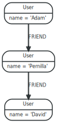

### 3.1.4. 고유성 (Uniqueness)

패턴 매칭 중에 Neo4j는 동일한 그래프 관계가 단일 패턴에서 여러 번 발견되는 일치 항목을 포함하지 않도록합니다. 대부분의 경우, 이것은 합리적인 일입니다.

예 : 사용자의 친구의 친구를 찾을 때 결과로 사용자를 돌려주지 않습니다.

몇 개의 노드와 관계를 만듭니다.

```Javascript
CREATE (adam:User { name: 'Adam' }),(pernilla:User { name: 'Pernilla' }),(david:User { name: 'David'
  }),
  (adam)-[:FRIEND]->(pernilla),(pernilla)-[:FRIEND]->(david)
```

그러면 다음 그래프가 표시됩니다.



이제 Adam의 친구들을 찾아 보겠습니다.

```Javascript
MATCH (user:User { name: 'Adam' })-[r1:FRIEND]-()-[r2:FRIEND]-(friend_of_a_friend)
RETURN friend_of_a_friend.name AS fofName
```

```
+---------+
| fofName |
+---------+
| "David" |
+---------+
1 row
```

이 쿼리에서 Cypher는 패턴 관계 `r1` 과 `r2` 가 동일한 그래프 관계를 가리키는 일치 항목을 반환하지 않도록합니다.

그러나 이것은 항상 바람직한 것은 아닙니다. 쿼리가 사용자를 반환해야하는 경우 다음과 같이 여러 `MATCH` 절에 일치를 분산시킬 수 있습니다.

```Javascript
MATCH (user:User { name: 'Adam' })-[r1:FRIEND]-(friend)
MATCH (friend)-[r2:FRIEND]-(friend_of_a_friend)
RETURN friend_of_a_friend.name AS fofName
```
```
+---------+
| fofName |
+---------+
| "David" |
| "Adam"  |
+---------+
2 rows
```

다음 쿼리는 이전 쿼리와 비슷하지만 실제로는 이전 쿼리와 같습니다.

```Javascript
MATCH (user:User { name: 'Adam' })-[r1:FRIEND]-(friend),(friend)-[r2:FRIEND]-(friend_of_a_friend)
RETURN friend_of_a_friend.name AS fofName
```
여기서 `MATCH` 절에는 두 개의 경로가있는 단일 패턴이 있지만 이전 쿼리에는 두 개의 별개 패턴이 있습니다.

```
+---------+
| fofName |
+---------+
| "David" |
+---------+
1 row
```
