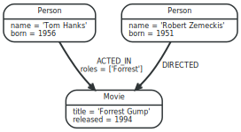
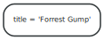
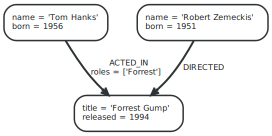
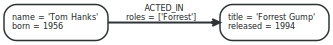
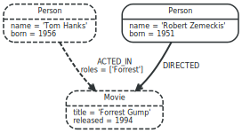
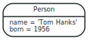
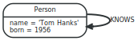

# 1.2. 그래프 데이터베이스 개념

###### 1.2. 에서는 그래프 데이터 모델을 소개합니다.

### 1.2.1. Neo4j 그래프 데이터베이스

 ###### 그래프 데이터베이스는 가장 일반적인 데이터 구조인 그래프로 데이터를 저장하며, 모든 종류의 데이터를 쉽게 액세스 할 수 있는 방식으로 표현할 수 있습니다. Neo4j그래프는 [특성 그래프모델(Property Graph Model)]()을 기반으로 합니다.

그래프 데이터베이스 용어에 대해서는 부록 B, [Terminology](https://neo4j.com/docs/developer-manual/current/terminology/)를 참고하세요.

단계별로 접근하는 예제그래프:



#### 1.2.1.1. 노드
###### Neo4j의 노드는 [속성(properties)](#1213-속성) 및 [레이블(labels)](#1214-레이블)이 있는 [속성 그래프(property graph model)](https://github.com/opencypher/openCypher/blob/master/docs/property-graph-model.adoc#pgm-definitions-node)에 설명된 노드입니다.

노드는 엔터티를 나타내는 데 자주 사용되지만, 도메인 관계에 따라 해당 용도로 사용될 수도 있습니다.

가장 단순한 그래프는 단일 노드입니다. 단일 속성 제목을 가진 하나의 노드로 구성된 아래 그래프를 참고하세요.



앞의 예제의 노드에 두 개의 노드와 하나의 속성을 추가하면, 다음과 같습니다.


#### 1.2.1.2. 관계
###### Neo4j의 관계는 관계 유형 및 특성으로 [특성 그래프 모델(property graph model)](https://github.com/opencypher/openCypher/blob/master/docs/property-graph-model.adoc#pgm-definitions-relationship)에 설명 된 [관계(properties)](https://neo4j.com/docs/developer-manual/current/introduction/graphdb-concepts/#graphdb-neo4j-properties)입니다.
그래프 데이터베이스에서 노드간의 관계는 연관데이터를 찾을 수 있는 핵심 기능입니다. 관계는 두 개의 노드를 연결하며, 유효한 소스 및 대상 노드를 지닙니다.

관계는 노드를 임의의 구조로 구성하여 그래프를 목록, 트리,지도 또는 복합 엔티티와 유사하게 만들 수 있습니다. 이 중 하나는 더 복잡하고 풍부게 상호 연결된 구조로 결합이 가능합니다.

우리의 예제 그래프는 관계를 추가하면 훨씬 더 이해하기 쉽습니다.



이 예에서는 관계 유형으로 ACTED_IN 및 DIRECTED를 사용합니다. ACTED_IN 관계의 roles 등록 정보에는 하나의 항목이 있는 배열 값이 있습니다.

아래는 ACTED_IN 관계입니다. Tom Hanks 노드를 소스 노드로, Forrest Gump를 대상 노드로 사용합니다.



Tom Hanks 노드는 나가는 관계를 가지며, Forrest Gump 노드는 들어오는 관계가 있음을 알 수 있습니다.

즉, 운행 또는 성능과 관련하여 반대 방향으로 중복 관계를 추가 할 필요가 없습니다.

관계에는 항상 방향이 있지만 응용 프로그램에서 유용하지 않은 방향은 무시할 수 있습니다.


노드는 자신과의 관계도 가질 수 있습니다.

위의 예는 Tom Hanks가 자신을 알고 있음을 의미합니다.

노드의 관계를 간단히 따라 가면서 찾을 수있는 것을 예제 그래프로 살펴 보겠습니다.


표 1.1. 관계의 방향과 유형의 사용

| 우리가 알고 싶은 것 | 어디에서 시작하는가 | 관계 유형 | 방향 |
| ---------- | :--------- | :----------- | ---------- |
| get actors in movie    | :Movie node       | :ACTED_IN       | 들어오는       |
| get movies with actor    | :Person node       | :ACTED_IN       | 나가는       |
| get directors of movie    | :Movie node       | :DIRECTED       | 들어오는       |
| get movies directed by    | :Person node       | :DIRECTED       | 나가는       |

#### 1.2.1.3. 속성
###### Neo4j의 속성은 [속성 그래프 모델(property graph model)](https://github.com/opencypher/openCypher/blob/master/docs/property-graph-model.adoc#pgm-definitions-property)에 설명 된 속성입니다. 노드와 관계 모두 속성을 가질 수 있습니다.

속성은 이름 (또는 키)이 문자열로 지정된 값입니다. 지원되는 속성값들은 다음과 같습니다.

- 숫자
- 문자열
- 논리형
- 위에 해당하는 것중에서 리스트

null은 유효한 속성값이 아닙니다. 속성 키의 부재를 데이터베이스에 저장하는 대신에 null로 모델링할 수 있습니다.

표 1.2. 속성 값 유형
| 유형|  설명 | 값 범위 |
| ---------- | :--------- | :------------ |
| boolean    | 이진 논리 값      | true 또는 false     |
| integer    | 64-bit integer      | -9223372036854775808 에서 9223372036854775807 |
| float    | 64-bit IEEE 754 floating-point number      | -       |
| String   | 유니 코드 문자 시퀀스      | 무한대      |

유형 및 값에 대한 자세한 내용은 Cypher [유형 시스템 CIP](https://github.com/opencypher/openCypher/blob/master/cip/1.accepted/CIP2015-09-16-public-type-system-type-annotation.adoc)를 참조하십시오.

#### 1.2.1.4. 레이블
###### Neo4j의 레이블은 [속성 그래프 모델(property graph model)](https://github.com/opencypher/openCypher/blob/master/docs/property-graph-model.adoc#pgm-definitions-label)에 설명 된 레이블입니다. 레이블은 역할 또는 유형을 노드에 지정합니다.

레이블은 노드를 집합으로 그룹화하는데 사용되는 명명된 그래프 구문입니다. 동일한 레이블로 레이블된 모든 노드는 동일한 집합에 속합니다. 많은 데이터베이스 쿼리는 작성하기 쉽고 실행이 더 효율적인 쿼리를 만들고, 전체 그래프대신에 이러한 집합으로 작업을 할 수 있습니다. 노드는 그래프의 레이블에 옵션추가를 포함하지 않는 레이블의 숫자를 나타낼 수 있다.

레이블은 제약 조건을 정의하고 속성에 대한 색인을 추가 할 때 사용됩니다.([1.2.1.7 스키마](#1217-스키마) 참조)

예를 들어, 사용자를 나타내는 모든 노드는 레이블 :User로 레이블 될 수 있습니다. 거기에, Neo4j에게 주어진 이름의 모든 사용자를 찾는 것과 같이 사용자 노드에서만 작업을 수행하도록 요청할 수 있습니다.

그러나 훨씬 더 많은 것을 위해 레이블을 사용할 수 있습니다. 예를 들어, 런타임 중에 레이블을 추가하거나 제거 할 수 있으므로 노드의 임시 상태를 표시하는 데 사용할 수 있습니다. A : 일시 중지 된 은행 계좌는 정지 된 은행 계좌를 나타내는 데 사용할 수 있습니다. a : 현재 시즌을 시작하는 야채를 나타내는 계절 레이블 등이 있습니다.

이 예에서는 그래프에 Person과 Movie 레이블을 추가합니다.


노드가 다중 레이블을 가질 수있는 방법을 예시하기 위해 : Actor 레이블을 Tom Hanks 노드에 추가해 봅니다.


#### 레이블 명

유니 코드 문자열을 레이블 이름으로 사용할 수 있습니다. Cypher에서 Cypher 식별자 규칙과의 충돌을 피하거나 레이블에 영숫자가 아닌 문자를 허용하려면 backtick ( ') 구문을 사용해야 할 수 있습니다. 관습에 따라 레이블은 CamelCase 표기법으로 작성되며 첫 번째 문자는 대문자입니다. 예를 들어, User 또는 CarOwner. Cypher 쿼리의 스타일 지정에 대한 자세한 내용은 [Cypher 스타일 가이드](https://github.com/opencypher/openCypher/blob/master/docs/style-guide.adoc)를 참조하십시오.

레이블에는 int의 id 공간이 있습니다. 즉, 데이터베이스에 포함 할 수있는 레이블의 최대 수는 약 20 억 개입니다.

#### 1.2.1.5. 순회
###### 순회(Traversal)은 경로를 찾기 위해 그래프를 탐색합니다.
순회(traversal)은 그래프를 조회하고 시작 노드에서 관련 노드로 이동하여, "내 친구가 내 음악을 좋아하지 않으면 어떤 음악을 좋아하는지" 또는 "이 전원 공급이 중단되면 어떤 웹 서비스 영향을 받습니까?"에 대한 답을 찾습니다.

그래프를 가로 지르는 것은 몇 가지 규칙에 의한 관계를 따라 노드를 방문하는 것을 의미합니다. 그래프에서 흥미로운 노드와 관계가 있는 부분을 이미 알고 있으므로 대부분의 경우 하위 그래프만 방문합니다.

Cypher는 순회(Traversal) 및 기타 기법을 사용하여 그래프를 쿼리하는 선언적 방법을 제공합니다. 자세한 내용은 [3. Cypher](../cypher/cypher.html)를 참조하십시오.

우리가 작은 예제 데이터베이스에 따라 Tom Hanks가 연기 한 영화를 찾고 싶다면 Tom Hanks 노드에서 시작하여 노드에 연결된 ACTED_IN 관계를 따르고 결과로 Forrest Gump로 마무리 합니다. 점선을 참고하세요 :



#### 1.2.1.6. 경로
###### Neo4j의 경로는 [속성 그래프 모델]()에 설명 된 경로입니다. 경로는 Cypher 쿼리 또는 순회에서 검색됩니다.

이전 예제에서 순회(Traversal) 결과는 경로로 반환 될 수 있습니다.


위 경로는 길이가 1입니다.

가능한 최단 경로는 길이가 0입니다. 즉, 단일 노드 만 있고 관계가 없는 경로이며 다음과 같이 표시 될 수 있습니다.


이 경로의 길이는 1입니다.


#### 1.2.1.7. 스키마
###### Neo4j는 선택적 스키마 그래프 데이터베이스입니다.
스키마없이 Neo4j를 사용할 수 있습니다. 선택적으로, 성능 또는 모델링 이점을 얻기 위해 스키마를 도입 할 수 있습니다. 이렇게 하면 스키마를 사용함으로써 얻을 수 있는 혜택을 누리고자 할 때 사용할 수 있습니다.

스키마 명령어는 Neo4j 클러스터의 마스터 시스템에만 적용될 수 있습니다. 슬레이브에 적용하면 Neo.ClientError.Transaction.InvalidType 오류 코드가 수신됩니다 ([7. Neo4j 상태 코드]() 참조).

#### 인덱스
```
데이터베이스에서는 노드를 찾는 속도를 향상시키는 인덱스를 생성함으로써, 성능을 향상시킬 수 있습니다.
```
Neo4j는 색인을 생성 할 속성을 지정하면 그래프가 발전함에 따라 색인이 최신 상태로 유지됩니다. 새로 인덱싱된 속성으로 노드를 검색하는 작업은 성능이 크게 향상됩니다.

결과적으로, Neo4j의 인덱스는 사용이 가능합니다.  즉, 처음 인덱스를 만들면 즉시 연산이 반환되게 됩니다. 인덱스는 백그라운드에서 채워지므로 쿼리에서 즉시 사용할 수는 없습니다. 인덱스가 백그라운드에 완전히 채워지면 결국 인덱스가 생성됩니다. 이는 이제 쿼리에서 사용할 준비가 되었음을 의미합니다.

인덱스에 문제가 발생하면 **실패** 상태가 될 수 있습니다. 실패하게 되면 쿼리 속도를 높이는 데 사용되지 않습니다. 이를 다시 작성하려면 인덱스를 삭제하고 재생성할 수 있습니다. 로그에서 실패에 대한 원인을 찾으시기 바랍니다.

Cypher의 인덱스 작업에 대해서는 [3.5.1 "인덱스"](../cypher/schema/index.html)를 참조하십시오.

#### 제약 조건

Neo4j는 데이터를 깨끗하게 유지하는 데 도움이됩니다. 그것은 제약 조건을 사용하여 그렇게 합니다. 제약 조건을 사용하면 데이터의 모양에 대한 규칙을 지정할 수 있습니다. 이 규칙을 위반하는 변경 사항은 거부됩니다.

Cypher의 제약 조건 작업에 대해서는 [3.5.2 "제약 조건"](../cypher/schema/constraints.html)을 참조하십시오.
